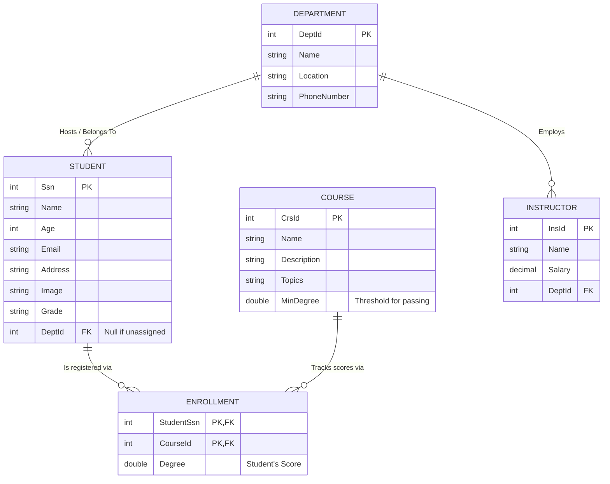

# 🎓 EduPlatform - E-Learning MVC Application

Welcome to **EduPlatform**, a comprehensive E-Learning management system built from the ground up using **ASP.NET Core MVC**. This application serves as a complete learning laboratory implementing modern design patterns, robust backend architecture, and a dynamic, responsive user interface.

## ✨ Key Features
- **Complete CRUD Operations**: Manage Students, Departments, and Courses seamlessly with dedicated interfaces.
- **Advanced Data Mapping**: Employs **AutoMapper** mapping profiles to transfer data safely between Database Entities and ViewModels.
- **Smart Grading System**: Condition-based rendering natively calculates and highlights Student Degrees against Course minimum passing values automatically.
- **Sleek UI/UX (Bootstrap 5)**: High-quality, polished interfaces structured securely via a centralized responsive navigation `_Layout`. Equipped with FontAwesome icons and Toast Notifications!
- **Entity Framework Core**: Full Code-First ORM integration bridging application logic seamlessly into MS SQL Server.

## 🛠️ Technology Stack
- **Framework**: ASP.NET Core MVC
- **Language**: C#
- **ORM**: Entity Framework Core
- **Database**: Microsoft SQL Server
- **Frontend Tools**: HTML5, CSS3, Bootstrap 5, FontAwesome
- **Data Mapping Libraries**: AutoMapper

---

## 🗄️ Database Schema & Architecture

The structural heart of this application contains a normalized database schema ensuring strong relational dependencies and constraint mappings.



> **Note:** The `Enrollment` table serves as a mapping layer representing the profound Many-To-Many relationship natively resolving Grade constraints between Courses and Students. 

---

## 🚀 Getting Started

Follow these instructions to safely unpack and configure a local replica of this project.

### Prerequisites
- [.NET SDK](https://dotnet.microsoft.com/download) installed.
- SQL Server (Express/Developer) or LocalDB setup.
- (Optional) Visual Studio 2022.

### Installation & Launch Instructions

1. **Clone the Repository:**
   ```sh
   git clone https://github.com/NourhanKhaled23/E-learning_MVC_ASP.net-Core_Course.git
   ```
2. **Navigate into the Application:**
   ```sh
   cd E-learning_MVC_ASP.net-Core_Course/WebApplication1
   ```
3. **Configure the Connection String:**
   Ensure `appsettings.json`'s `DefaultConnection` maps properly to your Database server configuration. It is populated by default to connect to local instances seamlessly!
4. **Deploy Database (Migrations):**
   Execute Entity Framework tools to unpack the Schema and automatically seed mock data.
   ```sh
   dotnet ef database update
   ```
5. **Run the Application:**
   ```sh
   dotnet run
   ```
   Open your browser to `https://localhost:XXXX/` *(check terminal)* and explore the platform!

---

## 💡 Recommendations & Future Expansions

Here are some suggested ways to further scale and elevate this project's bounds natively:
- **Identity & Authentication 🔐:** Wrap controllers with `[Authorize]` attributes and implement ASP.NET Core Identity to manage Role-Based access control (Admin, Instructor, Student logins).
- **Extensive UI Data-Tables 📊:** Embed data pagination, extensive searching, and asynchronous sorting via AJAX using libraries like `DataTables.net`.
- **API Construction 💻:** Expose `Course` grades outwardly via Web API Endpoints `Controllers/Api` returning bare-bone JSON structures extending possibilities to external React/Angular dashboards!
